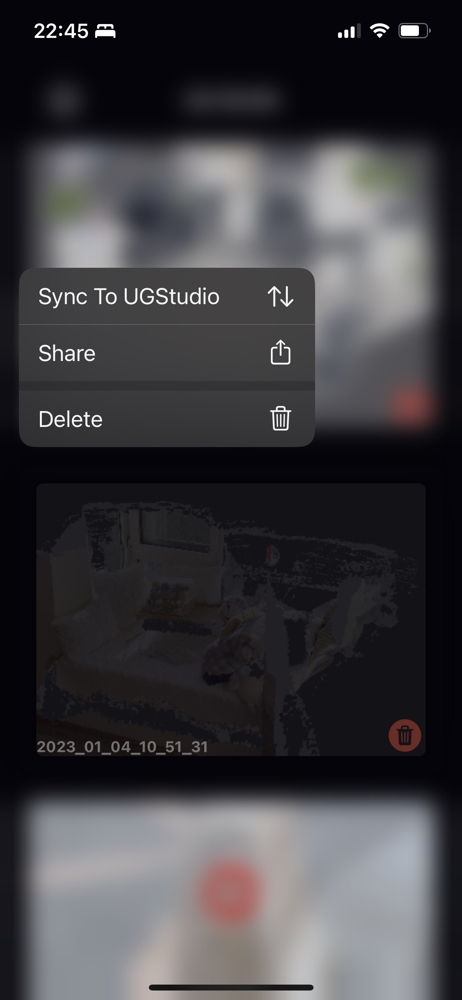
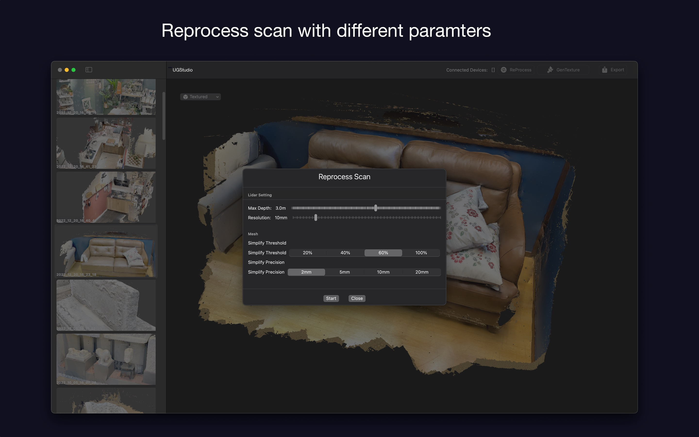
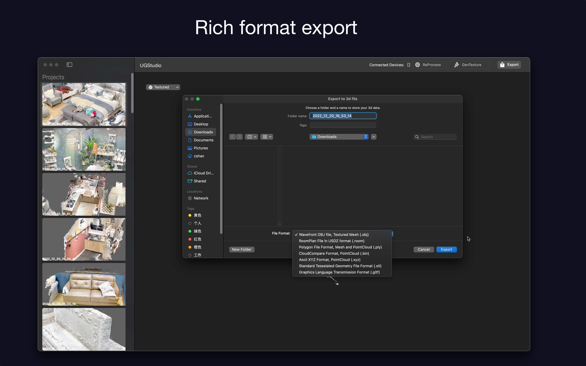

## UGStudio simple tutorial

#### Step1 Install UGScan on your iOS Deivce (Lidar needed)
#### Step2 Install UGStudio on your macOS device
#### Step3 Scan room or objects
#### Step4 Sync scan to UGStudio
Keep UGStudio open and in same wifi network with iOS device

#### Step5 Process data in UGStudio

##### Reprocess scan

##### Generate texture

##### Export data
